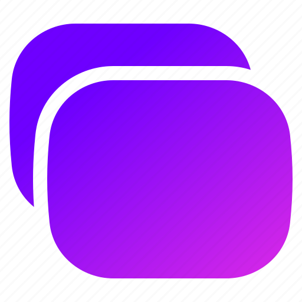

### nightTab icon
 https://github.com/zombieFox/nightTab/blob/main/src/icon
## Sources
 [Gmail icon](https://de.m.wikipedia.org/wiki/Datei:Gmail_icon_%282020%29.svg)  
 [Google Drive icon](https://de.m.wikipedia.org/wiki/Datei:Google_Drive_icon_%282020%29.svg)  
 [YouTube full-color icon](https://pdc.m.wikipedia.org/wiki/Feil:YouTube_full-color_icon_%282017%29.svg)  
 [Google Maps icon](https://de.m.wikipedia.org/wiki/Datei:Google_Maps_icon_%282020%29.svg)  
 [Google Translate icon](https://de.m.wikipedia.org/wiki/Datei:Google_Translate_logo.svg)  
 [Ookla Speedtest icon](https://www.rvmobileinternet.com/gear/ookla-speed-test)  
 [New Tab icon](https://www.iconfinder.com/icons/11336518/tab_new_browser_web_tabs_icon)  
 [Wallpaper](https://www.hdwallpapers.in/lines_minimalist_square_artistic_purple_hd_abstract-wallpapers.html)
